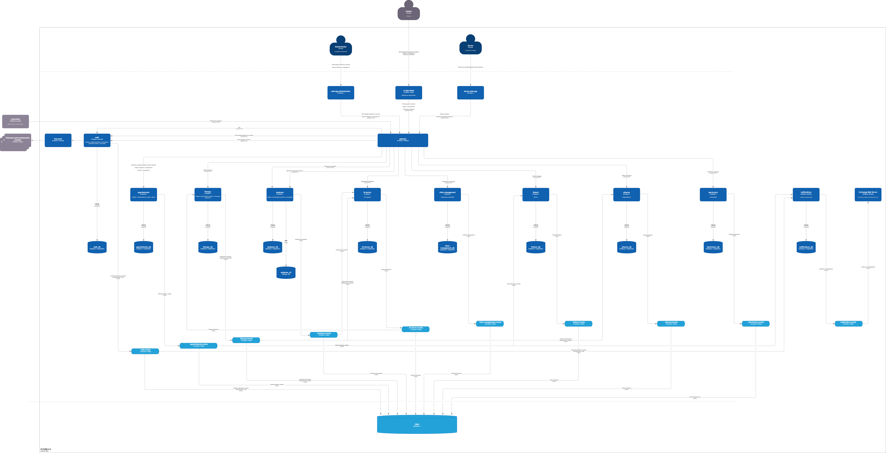

# Задание 3. Проектирование целевой архитектуры и оценка рисков внедрения

## Целевая архитектура (C4 Model)

## Карта рисков трансформации
| ID | Категория риска | Вероятность | Влияние |
| --- | --- | --- | --- |
| Архитектурный | Нарушение требований регуляторов (Комплаенс): случайная утечка данных медицинских карт или банковской тайны в общий аналитический слой (ClickHouse). | Средняя | Высокое |
| Архитектурный | Деградация производительности (Data Explosion): резкий рост объема near-real-time событий от новых доменов («Фарма», «Электроника») перегрузит брокер сообщений. | Средняя | Средняя |
| Технологический | Отказ Legacy-систем при миграции: высокая нагрузка на старый SQL Server 2008 в процессе извлечения исторических данных приведет к остановке клиник или банка. | Высокая | Высокая |
| Технологический | Вендор-лок / Недоступность облака: отказ или блокировка инфраструктуры провайдера, на котором развернут Kubernetes и Kafka. | Низкая | Высокое |
| Организационный | Дефицит компетенций (Команда): текущие инженеры компании умеют работать только с T-SQL и PowerBuilder, и не справятся с Apache Kafka, Flink и микросервисами. | Высокая | Высокая |
| Организационный | Саботаж и размытие сроков (Time-to-Market): домены (особенно новый Банк) будут затягивать согласование контрактов данных, защищая свою автономию. | Высокая | Среднее |

## План управления рисками1. 
### 1. Технические методы минимизации рисков

*   **Решение для ИБ и Комплаенса **:
    *   *Двойной слепой контур (Data Masking)*: На уровне компонента Outbox в каждом домене персональные данные хэшируются с уникальной солью (`SHA-256(PII + Salt)`). 
    *   *Сетевой периметр*: База данных аналитического ClickHouse физически не имеет сетевых маршрутов (VPC Peering/Firewall) к таблицам с медицинскими картами и историями болезней.
    *   *Ролевая модель*: Доступ к витринам самообслуживания настраивается на уровне строк (Row-Level Security) на основе корпоративного OAuth2/OIDC.
*   **Решение для защиты Legacy от падения **:
    *   *Запрет на прямой ETL/Select*: Категорически запрещено запускать аналитические `SELECT`-запросы к промышленному SQL Server 2008. 
    *   *Использование CDC*: Для выгрузки данных применяется технология **Change Data Capture** (Debezium). Он асинхронно читает бинарные логи транзакций напрямую с диска, что создает околонулевую нагрузку на процессор СУБД и исключает блокировки таблиц.
*   **Решение для управления объемами данных **:
    *   *Квотирование и Backpressure*: На уровне Apache Kafka настраиваются жесткие лимиты на пропускную способность (bytes/sec) для каждого домена-продюсера.
    *   *Реактивные потоки*: Использование Apache Flink и реактивных библиотек позволяет автоматически замедлять чтение событий, если потребители (Consumers) не успевают их обрабатывать, предотвращая падение памяти (OOM).
*   **Решение проблемы вендор-лока **:
    *   *Multi-Cloud / Hybrid Cloud Ready*: Вся микросервисная архитектура холдинга упаковывается в независимые Docker-контейнеры и разворачивается через ванильный Kubernetes (K8s). Скрипты развертывания описываются строго как код (**Terraform / Helm**), что позволяет оперативно перенести систему в контур другого провайдера или на On-Premise сервера при форс-мажоре.

### 2. Управленческие (Организационные) подходы

*   **Решение проблемы дефицита кадров **:
    *   *Стратегия «Двух скоростей» (Bimodal IT)*: Формируется выделенная Core-команда сильных внешних архитекторов и Data-инженеров со знанием Kafka/Flink для построения фундамента. Текущие разработчики legacy-систем делятся на группы и проходят поэтапное переобучение (Upskilling) через участие в парном программировании с приглашенными экспертами.
    *   *Платформа как сервис (Internal Developer Platform — IDP)*: Центральная ИТ-команда создает для доменов готовые шаблоны и SDK (микросервисы на Go/Java с уже настроенным логированием, мониторингом и встроенной отправкой событий в Kafka). Разработчикам на местах не нужно глубоко знать внутреннее устройство брокера, они используют готовые методы абстракции.
*   **Решение проблемы саботажа доменов **:
    *   *Продуктовый подход к данным (Data Product Owners)*: В каждом домене назначается роль Data Product Owner (Владелец продукта данных). Его личные KPI и годовой бонус жестко привязываются к двум метрикам: «Своевременность публикации контракта данных в Schema Registry» и «Индекс удовлетворенности (NPS) внутренних потребителей его витрины».
    *   *Архитектурный комитет холдинга*: Вводится еженедельный фасилитационный совет под председательством СТО холдинга, где любые конфликты интерпретации бизнес-логики (например, как считать «активного клиента» для банка и клиники) оперативно решаются в течение 48 часов с фиксацией в корпоративной базе знаний (Confluence).