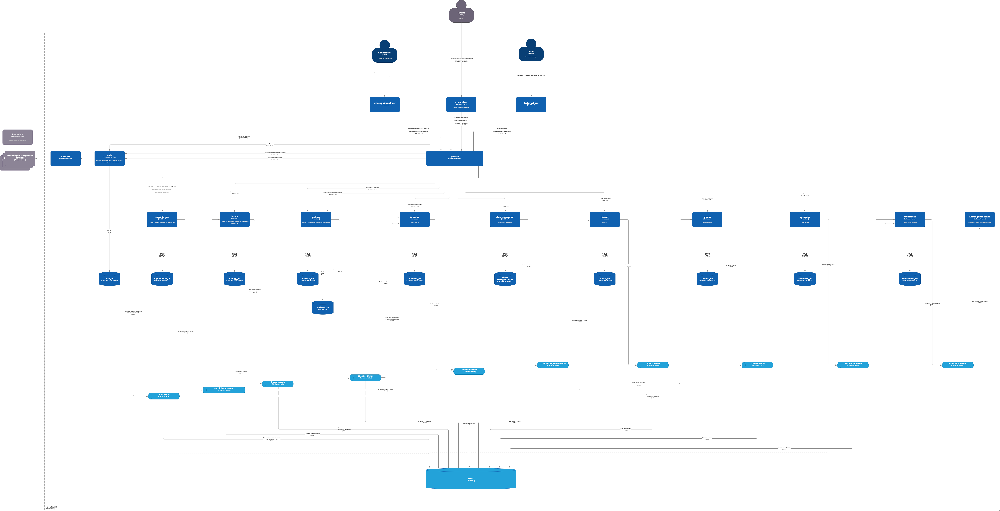

# Задание 4. Моделирование домена и интеграций

## Целевая архитектура 

---
* bounded-contexts [bounded-contexts.md](bounded-contexts.md)
* event-storming [event-storming.md](event-storming.mmd)
* aggregates [bounded-contexts.md](bounded-contexts.md)
* events [bounded-contexts.md](bounded-contexts.md)
* Событийный подход vs Camel/DWH. [bounded-contexts.md](bounded-contexts.md)