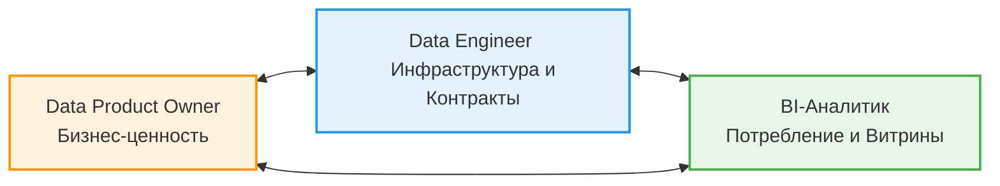

# Стратегический роадмап внедрения Data Mesh в холдинге «Будущее 2.0»

Переход на концепцию децентрализованной фабрики данных (**Data Mesh**) призван ликвидировать монолитное бутылочное горлышко в обработке сотен терабайт данных и сократить Time-to-Market при подключении новых бизнес-вертикалей («Фармацевтика», «Производитель электроники»).

---

## 1. Ключевые роли и зоны ответственности

Внедрение Data Mesh требует перехода от централизованной ИТ-команды к кросс-функциональным доменным командам. В каждом домене выделяются три ключевые роли:

*   **Data Product Owner (DPO) — Владелец продукта данных:**
    *   *Кто это:* Бизнес-эксперт внутри конкретного домена (например, Финтех или Операционная медицина).
    *   *Зона ответственности:* Относится к данным домена как к коммерческому продукту. Определяет состав витрин, отвечает за качество (Data Quality), комплаенс (ИБ) и удобство использования данных другими подразделениями холдинга. Его KPI привязан к SLA доступности продукта данных.
*   **Data Engineer (DE) — Дата-инженер домена:**
    *   *Кто это:* Технический специалист, закрепленный за доменной командой.
    *   *Зона ответственности:* Проектирует внутренние ETL/ELT пайплайны, настраивает CDC-коннекторы (Debezium) к операционным базам. Разрабатывает и публикует контракты данных (Avro/Protobuf схемы) в центральный Schema Registry.
*   **BI-Аналитик домена:**
    *   *Кто это:* Дата-аналитик, работающий бок о бок с бизнесом на местах.
    *   *Зона ответственности:* Проектирует семантический слой (dbt/Cube.js) поверх аналитических баз (ClickHouse), собирает кастомные отчеты на портале самообслуживания Apache Superset и обучает конечных пользователей работе с данными.

---

## 2. Этапы внедрения Data Mesh

Трансформация рассчитана на 36 месяцев и синхронизирована с фазами модернизации ландшафта холдинга.

```mermaid
gantt
    title Роадмап внедрения Data Mesh (0–36 мес.)
    dateFormat  X
    axisFormat %s

    section Этап 1: Пилот
    Проектирование IDP-платформы (0-3 мес) :active, 0, 3
    Пилот доменов Расчеты и Пациенты (3-6 мес) : 3, 6

    section Этап 2: Масштабирование
    Миграция критических доменов (6-12 мес) : 6, 12
    Запуск Near-Real-Time и Стриминга (12-18 мес) : 12, 18

    section Этап 3: Поддержка
    Подключение новых доменов Фарма/Железо (18-24 мес) : 18, 24
    Глобальная экспансия и Data Residency (24-36 мес) : 24, 36
```

### Этап 1: Пилотный запуск (0–6 месяцев)
*   **Бизнес-цель:** Формирование архитектурного каркаса, запуск портала самообслуживания для первых инкрементов, снижение времени подготовки базовой отчетности с часов до минут.
*   **Ключевые задачи:**
    1.  Создание **Internal Developer Platform (IDP)** — центральная дата-платформа разворачивает облачный кластер Kafka, Schema Registry и ClickHouse, предоставляя доменам готовые шаблоны инфраструктуры («Платформа как сервис»).
    2.  Запуск пилота в доменах **«Финансовые расчеты»** (`FintechCore`) и **«Пациентский поток»** (`MedicalCore`). 
    3.  Назначение первых **Data Product Owners** в пилотных доменах. Проектирование первых контрактов данных без передачи персональной и медицинской тайны.
*   **Результат:** Бизнес-пользователи пилотных доменов самостоятельно строят аналитические срезы в Apache Superset. Ошибки в очередях изолируются через DLQ.

### Этап 2: Масштабирование (6–18 месяцев)
*   **Бизнес-цель:** Ликвидация зависимости от старой синхронной шины Apache Camel и монолита MS SQL Server 2008 на критических путях, переход аналитики к режиму Near-Real-Time.
*   **Ключевые задачи:**
    1.  Развертывание **Антикоррупционных слоев (ACL)** на базе Debezium (CDC) для безопасного асинхронного снятия данных с легаси-систем.
    2.  Перенос домена **`MedAI` (ИИ-сервисы)** на рельсы Data Mesh. ИИ-модели начинают потреблять поток событий `StudyUploaded` из Kafka и публиковать результаты инференса асинхронно.
    3.  Внедрение потоковой обработки данных на базе **Apache Flink** для расчета сквозных финансовых KPI холдинга на лету (задержка обновления данных на портале < 5 секунд).
*   **Результат:** Все ключевые домены холдинга функционируют как независимые узлы Data Mesh. Старое DWH используется только как исторический архив.

### Этап 3: Поддержка (18–36 месяцев)
*   **Бизнес-цель:** Обеспечение бесшовного подключения новых активов, выход в 2–3 новых географических региона с соблюдением локального законодательства (Data Residency).
*   **Ключевые задачи:**
    1.  Полный вывод из эксплуатации Apache Camel и SQL Server 2008. Взаимодействие переведено на реактивные потоки данных.
    2.  Интеграция новых доменов **«Фармацевтика»** и **«Производитель электроники»**. Благодаря готовой платформе (IaC) новые компании подключаются к обмену данными за несколько дней, просто подписываясь на топики Kafka холдинга.
    3.  Реализация мультирегиональной архитектуры. Развертывание локальных облачных контуров в новых регионах через Terraform. Персональные данные хранятся строго локально, а в центральный ClickHouse холдинга через Kafka MirrorMaker стримятся только агрегированные, деобезличенные бизнес-события.
*   **Результат:** Холдинг представляет собой слабосвязанную, отказоустойчивую событийную экосистему, готовую к мгновенному масштабированию продуктов и географии.
